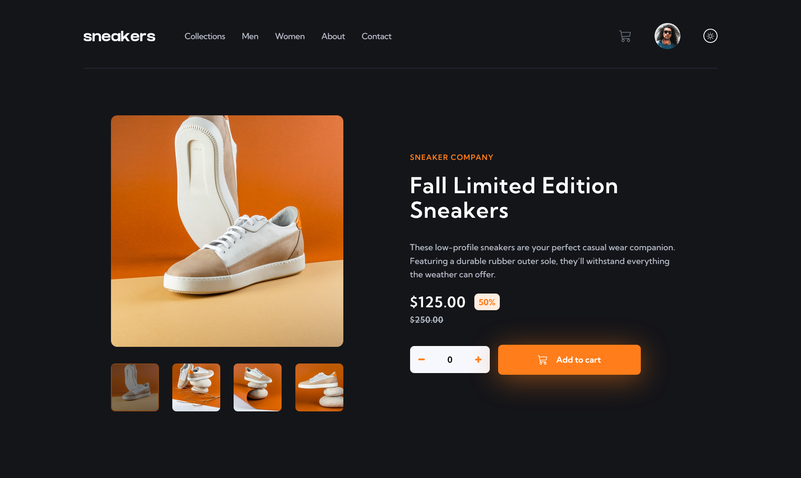
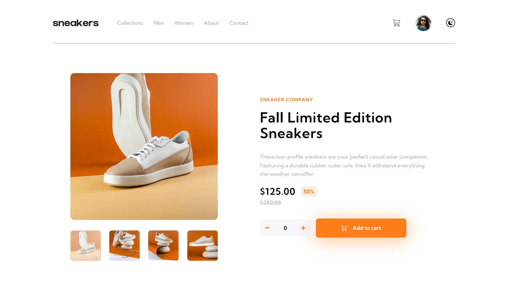
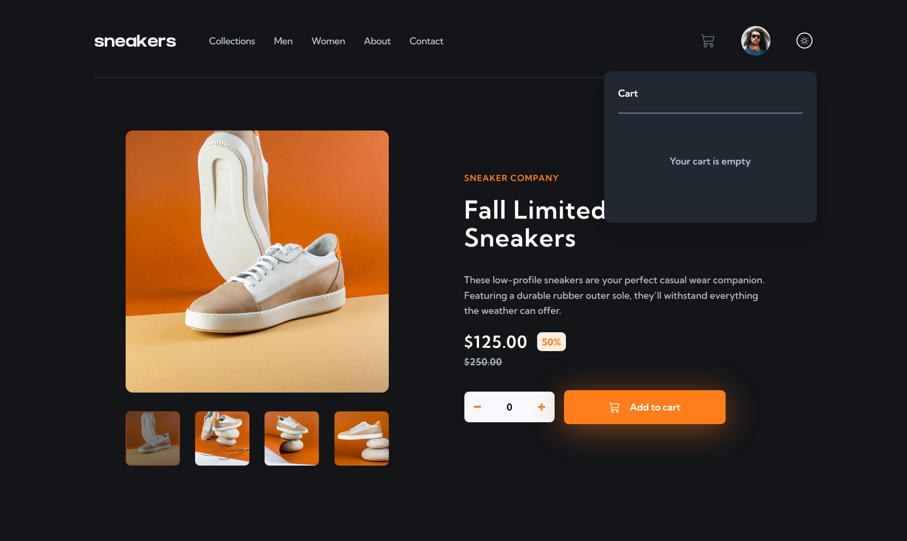
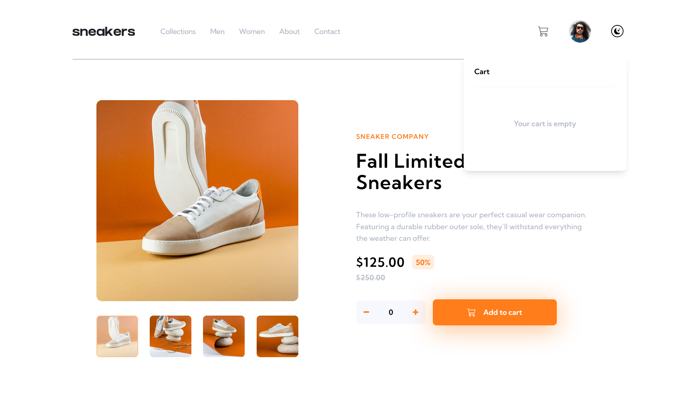

# Frontend Mentor - E-commerce product page solution

This is a solution to the [E-commerce product page challenge on Frontend Mentor](https://www.frontendmentor.io/challenges/ecommerce-product-page-UPsZ9MJp6). Frontend Mentor challenges help you improve your coding skills by building realistic projects.

## Table of contents

- [Overview](#overview)
  - [The challenge](#the-challenge)
  - [Screenshot](#screenshot)
  - [Links](#links)
- [Dependencies](#dependencies)
  - [Built with](#built-with)
  - [What I learned](#what-i-learned)
  - [Continued development](#continued-development)
- [Author](#author)
- [Acknowledgments](#acknowledgments)

## Overview

This ecommerce product page was build with React-redux app. For styles I used tailwind CSS and for animations framer-motion. I also designed a dark mode of this page with very nice color scheme. This website is also responsive for all devices. I'm quite happy with the result.

### The challenge

Users should be able to:

- View the optimal layout for the site depending on their device's screen size
- See hover states for all interactive elements on the page
- Open a lightbox gallery by clicking on the large product image
- Switch the large product image by clicking on the small thumbnail images
- Add items to the cart
- View the cart and remove items from it

### Screenshot






These are some screenshots of the finished version.

### Links

- Solution URL: [Solution URL here](https://www.frontendmentor.io/solutions/responsive-ecommerce-landing-page-using-tailwind-with-darklight-mode-Q_3SpzXbOw)
- Live Site URL: [Live site URL here](https://ecommerce-landing-page8.netlify.app/)

## Dependencies
- `framer-motion`
- `redux`
- `@redujs/toolkit`
- `react`
- `react-dom`
- `react-icons`
- `react-redux`
- `react-scripts`

To install all of the dependencies run ```npm install``` on your local terminal

### Built with

- Semantic HTML5 markup
- CSS custom properties
- Flexbox
- Mobile-first workflow
- [React](https://reactjs.org/) - JS library
- [Redux](https://redux.js.org/) - For state management
- [Tailwind-CSS](https://tailwindcss.com/) - For styles
- [Framer-motion](https://www.framer.com/motion/) - For animations

### What I learned

Basically I used redux because I wanted to practice it and it's actually a great tool when you understand it. I'm not going list all the code snippets of what I learned but you can learn redux with this [redux-tutorial](https://redux.js.org/tutorials/essentials/part-2-app-structure).

```javascript
const systemTheme = window.matchMedia("(prefers-color-scheme: dark)").matches;
```

### Continued development

For my next project I want to use redux for making api calls with multiple endpoints.


## Author

- Frontend Mentor - [@Dytoma](https://www.frontendmentor.io/profile/Dytoma)
- Twitter - [@OmarDytoma](https://www.twitter.com/OmarDytoma)


# React-redux app
# Getting Started with Create React App and Redux

This project was bootstrapped with [Create React App](https://github.com/facebook/create-react-app), using the [Redux](https://redux.js.org/) and [Redux Toolkit](https://redux-toolkit.js.org/) template.

## Available Scripts

In the project directory, you can run:

### `npm start`

Runs the app in the development mode.\
Open [http://localhost:3000](http://localhost:3000) to view it in your browser.

The page will reload when you make changes.\
You may also see any lint errors in the console.

### `npm test`

Launches the test runner in the interactive watch mode.\
See the section about [running tests](https://facebook.github.io/create-react-app/docs/running-tests) for more information.

### `npm run build`

Builds the app for production to the `build` folder.\
It correctly bundles React in production mode and optimizes the build for the best performance.

The build is minified and the filenames include the hashes.\
Your app is ready to be deployed!

See the section about [deployment](https://facebook.github.io/create-react-app/docs/deployment) for more information.

### `npm run eject`

**Note: this is a one-way operation. Once you `eject`, you can't go back!**

If you aren't satisfied with the build tool and configuration choices, you can `eject` at any time. This command will remove the single build dependency from your project.

Instead, it will copy all the configuration files and the transitive dependencies (webpack, Babel, ESLint, etc) right into your project so you have full control over them. All of the commands except `eject` will still work, but they will point to the copied scripts so you can tweak them. At this point you're on your own.

You don't have to ever use `eject`. The curated feature set is suitable for small and middle deployments, and you shouldn't feel obligated to use this feature. However we understand that this tool wouldn't be useful if you couldn't customize it when you are ready for it.

## Learn More

You can learn more in the [Create React App documentation](https://facebook.github.io/create-react-app/docs/getting-started).

To learn React, check out the [React documentation](https://reactjs.org/).
